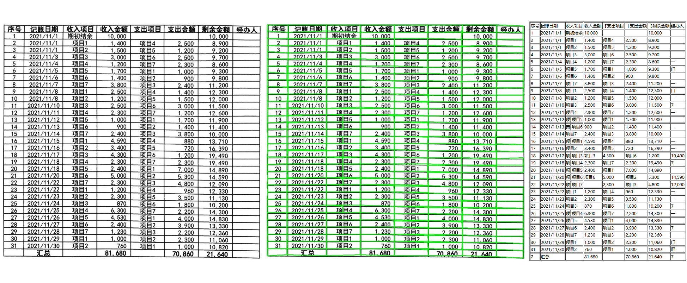

## About Me:
 I'm a Computer Vision Engineer.   
Main Research Areas 
**Intelligent Document/3D Vision/Multimodal Large Language Models**  
Base: **BeiJing**   

## Papers
* 2025 🎉 Document Image Rectification: [ForCenNet: Foreground-Centric Network for Document Image Rectification]() in **ICCV25**
* 2024 🎉 Stereo Matching: [A Transformer-Based Architecture for High-Resolution Stereo Matching](https://ieeexplore.ieee.org/document/10387769) in **IEEE Transactions on Computational Imaging**
* 2023 🎉 6D Pose Tracking: [FC-TrackNet: Fast Convergence Net for 6D Pose Tracking in Synthetic Domains](https://doi.org/10.1609/aaai.v37i13.27077) in **AAAI23**

## Open Work
|Time                   | Task                 | Model         |   Overview    |   Case        | 
|---------------------- |----------------------|---------------|---------------|---------------|
|2025| Text Translation from Captured Images | Coming Soon | This work extracts text from images and restores translations onto them, achieving high visual quality. |
|2025| Table Structure Recognition |[An effective table structure recognition model and dataset](https://github.com/caipeng328/wired_table_rec)| We provide an efficient table structure detection model that effectively handles complex cell merging and cell positioning. It supports output in HTML, JSON, and other custom formats.| | 
|2025| OCR Detection and Handwritten Region Awareness | Coming Soon | For specific needs, accurate identification of handwritten regions is essential. We offer a model that outputs both OCR detection boxes and a handwriting probability map. The training scripts and dataset will be open-sourced.|  |
|2025| Lightweight Facial Landmark Detection | Coming Soon | We provide a lightweight facial landmark model under 5MB that outputs 106 keypoints. It is trained on six public datasets with enhanced alignment and loss balancing to support joint training across datasets of different scales. | |
