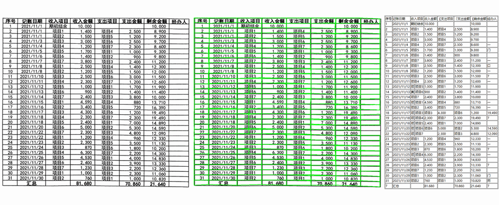
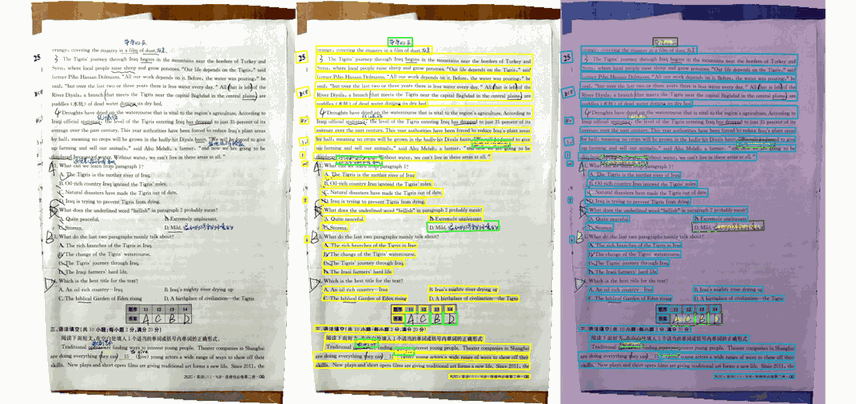
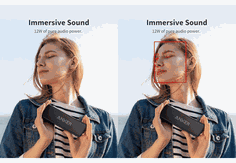
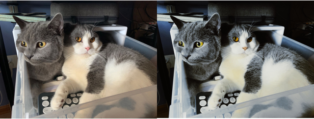

## About Me:
 I'm a Computer Vision Engineer.   
Main Research Areas 
**Intelligent Document/Document parse/3D Vision/Multimodal Large Language Models**  
Base: **BeiJing**   

## Papers
* 2025 🎉  **ICCV25**: [ForCenNet: Foreground-Centric Network for Document Image Rectification](). 
* 2024 🎉 **Transactions on Computational Imaging**: [A Transformer-Based Architecture for High-Resolution Stereo Matching](https://ieeexplore.ieee.org/document/10387769). 
* 2023 🎉 **AAAI23**: [FC-TrackNet: Fast Convergence Net for 6D Pose Tracking in Synthetic Domains](https://doi.org/10.1609/aaai.v37i13.27077)

## Open Work
|Time                   | Task                 | Model         |   Overview    |   Case        | 
|---------------------- |----------------------|---------------|---------------|---------------|
|2025| Text Translation from Captured Images | Coming Soon | This work extracts text from images and restores translations onto them, achieving high visual quality. |
|2025| Table Structure Recognition |[An effective table structure recognition model and dataset](https://github.com/caipeng328/wired_table_rec)| We provide an efficient table structure detection model that effectively handles complex cell merging and cell positioning. It supports output in HTML, JSON, and other custom formats.| | 
|2025| OCR Detection and Handwritten Region Awareness | [Handwritten Awareness and Detection](https://github.com/caipeng328/Handwritten-Awareness-and-Detection/tree/main) | For specific needs, accurate identification of handwritten regions is essential. We offer a model that outputs both OCR detection boxes and a handwriting probability map. The training scripts and dataset will be open-sourced.|  |
|2025| Lightweight Facial Landmark Detection | [Lite Face Keypoint detection](https://github.com/caipeng328/lite_face_kyepoint) | We provide a lightweight facial landmark model under 5MB that outputs 106 keypoints. It is trained on six public datasets with enhanced alignment and loss balancing to support joint training across datasets of different scales. | |
|2025| Two LUT Reading Implementations: CPU (Eigen) and GPU (PyTorch) Versions | [OPENLUT](https://github.com/caipeng328/lite_face_kyepoint) | Here are two implementations: one uses Eigen to quickly read LUT files with an average speed of about 0.5 seconds; the other is a GPU-accelerated version based on PyTorch, achieving an average speed of around 0.1 seconds. | |
